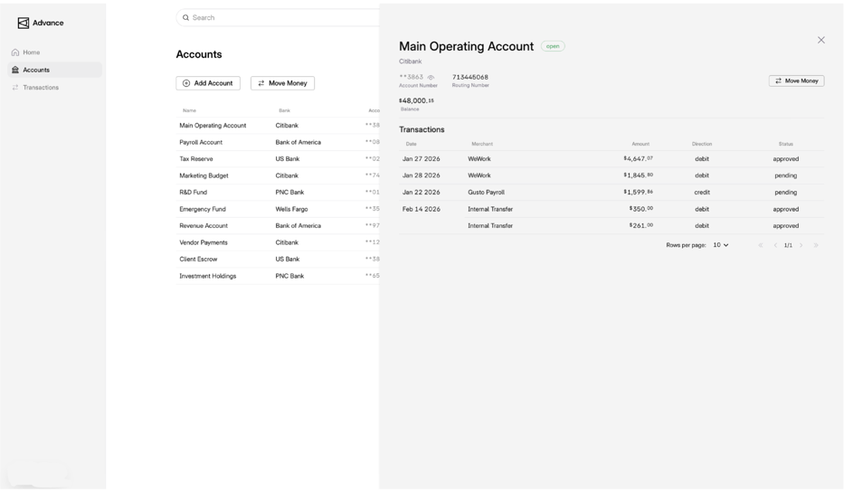
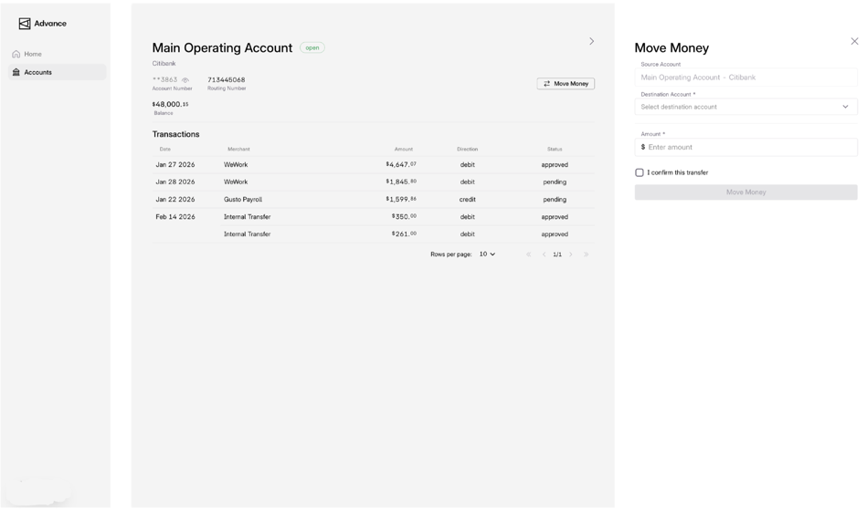
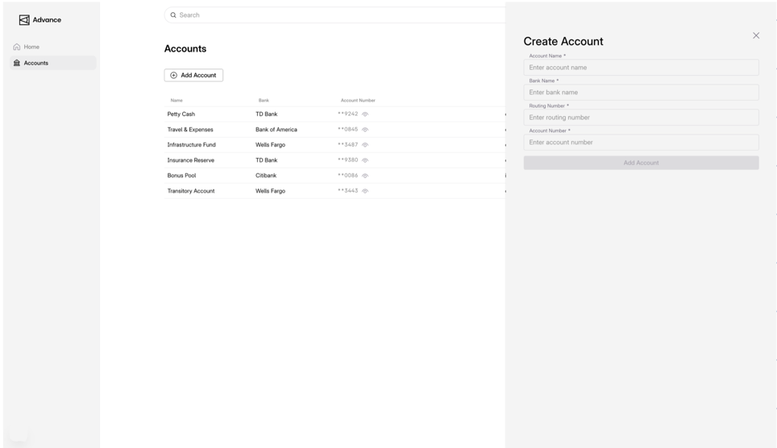
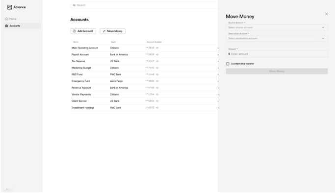
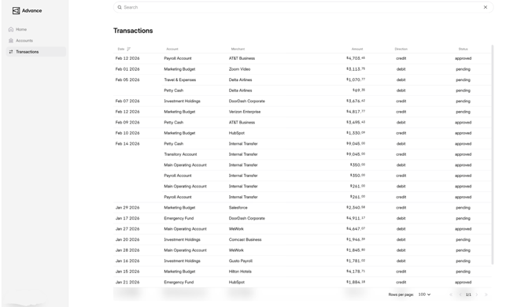

# Advance Frontend - Interview Assignment

A Next.js application with the full Advance design system, component library, and layout infrastructure.

## Prerequisites

- Node.js 22.9.0
- Yarn 1.22.22

## Setup

```bash
yarn install
yarn dev
```

Open [http://localhost:3000](http://localhost:3000).

## Available Commands

| Command | Description |
|---------|-------------|
| `yarn dev` | Start dev server (Turbo mode) |
| `yarn build` | Production build |
| `yarn ts` | TypeScript type check |
| `yarn lint` | ESLint |
| `yarn lint:fix` | ESLint autofix |
| `yarn fm:check` | Prettier check |
| `yarn fm:fix` | Prettier fix |
| `yarn generate:component` | Scaffold a new component |
| `yarn generate:view` | Scaffold a new view |

## Project Structure

```
src/
  app/                    # Next.js App Router
  components/             # Reusable UI components (FlexxTable, DrawerWrapper, etc.)
  @core/                  # Design system: theme, contexts, hooks, styles
  @layouts/               # Layout components
  @menu/                  # Navigation components
  flexxApi/               # API client layer
  QueryClient/            # React Query configuration
  hooks/                  # Shared custom hooks
  domain/                 # TypeScript type definitions
  utils/                  # Utility functions
  configs/                # App configuration
  constants/              # Constants
```

## Key Components

- **FlexxTable** - Data table with sorting, filtering, pagination
- **DrawerWrapper** - Drawer/panel layout component
- **FlexxCustomTextInputs** - Form input components
- **AdvanceCurrencyText** - Currency formatting component
- **FlexxDashboardWrapper** - Page wrapper component

## Backend API Schema

[API Documentation](https://internal-fe-mock-provider.r6zcf729z3zke.us-east-1.cs.amazonlightsail.com/docs)

## Tasks

This is a FE task evaluating your skills.

### 1. Account Drawer

When clicking on an account in the accounts dashboard, open a drawer that has a header with the account's details and a table with all of its transactions.



### 2. Create Account

Implement a "Create Account" CTA on the accounts dashboard. When clicked it should open a drawer with text fields for all the attributes of an account and an "Add Account" button. After creating the account, the accounts dashboard should open the drawer to the newly created account.


### 3. Move Money

Implement a "Move Money" CTA on the accounts dashboard. When clicked it should open a drawer with the following fields: source account, destination account, and amount. Add a checkbox that needs to be checked before being able to initiate the move money. Include a "Move Money" button to submit.


### 4. Transactions Dashboard

Add a transactions dashboard that shows all the transactions in a table.


### Any additional features you would like to add will be appreciated!!
Be sure to let us know what you have added and why.

### You will be evaluated based on: 
1. The quality of the code
2. The UI/UX
3. The maintainability of the code


## Stack

- Next.js 16 with App Router
- React 19
- TypeScript
- MUI v5
- Tailwind CSS
- TanStack Query v5
- React Hook Form

For any questions contact orri.nehamkin@advancehq.com


___

## Additional Features & Improvements

Beyond the four required tasks, the following were added — with the reasoning behind each:

- **Migrated the data layer from `react-query` v3 to TanStack Query v5.** The v3 footprint
  was tiny (one query, no mutations), and the assignment required building out a whole data
  layer (mutations for Create Account / Move Money, queries for transactions). Migrating
  first meant every new hook was written in the modern idiom — object-form `useQuery`, global
  error handling via `QueryCache`/`MutationCache`, SSR-safe devtools — instead of building on
  an end-of-life library.

- **TanStack Query Devtools** wired into the app for inspecting cache, query keys, and
  fetch states during development.

- **Made the account search reliable.** The query key was a constant `[ACCOUNTS]` without the
  search term, so React Query (which caches by key) did not refetch deterministically when the
  term changed. The fix puts the term in the key (`[ACCOUNTS, term]`), plus debounced input,
  `keepPreviousData` to avoid flicker, and a clear button shown only when there is a term.

- **Fixed several bugs found in the provided code:**
  - SSR hydration error from a `<Chip>` (a `div`) rendered inside a `<Typography>` paragraph.
  - `origin is not defined` 500 crash on `/accounts` from a global `origin` passed as a prop.
  - Drawers/modals could not be closed by clicking outside — the backdrop used
    `visibility: hidden`, which also removes it from hit-testing; switched to a transparent
    (but clickable) backdrop.

- **Targeted `FlexxTable` sorting fix.** The table sorted the *rendered* cell value
  (`data[field].toString()`), so the Account Number column — which renders a JSX component —
  stringified to `[object Object]` and never sorted by the real number, and dates only sorted
  via a bolted-on `comparator` + row-`metadata` workaround. Cells can now optionally be
  `{ value, content }`: sorting uses `value`, rendering uses `content`. The account-number
  column sorts by its real value and the date columns sort chronologically with the workaround
  removed — a small, backward-compatible change to the table's sort/cell layer. I deliberately
  did **not** rewrite the whole table onto `@tanstack/react-table`: all features already worked,
  the rewrite would touch the shared primitive plus every call site for no user-visible gain,
  and TanStack is headless so it would not remove the UI work. The restraint plus the
  documented critique is the intended signal.


